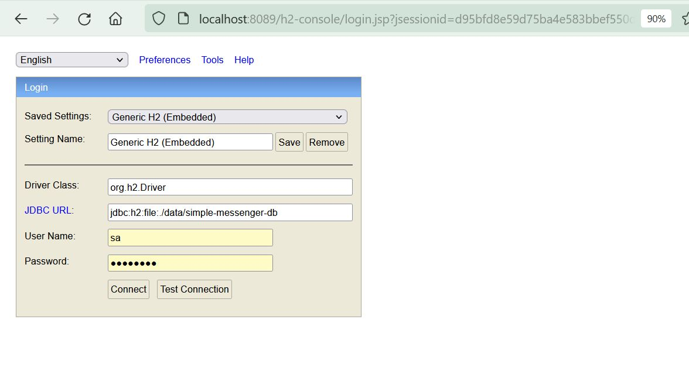
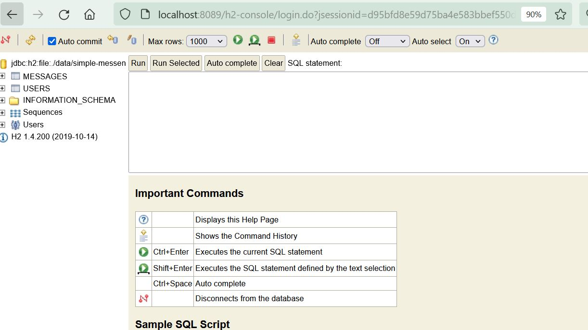

# Simple-Messenger-API Using Spring Boot

Backend api that would enable a web app to build a simple messenger application.

This is a Spring Boot application which exposes two API's for a web application to build a messenger app.
Used simple embbeded H2 file based database for data storage and for persistence.

Pre requisites:
1. Make sure Java 8 or higher is installed on our local system.
2. Install maven on our system.

Steps to Run the Application:
1. Clone or download the git repository named simple-messenger to your local.
2. Open your command line and change your directory to simple-messenger.
3. Run 'mvn clean install' to start the application (by default the application will start on 8089, if the port is occupied or you want to use a different port, then traverse to src\main\resources\application.properties and change server.port).
4. On the application start the DB schema will be created. and we need to access h2 console to add users before we start using API for sending messages and getting messages.

H2 Console Access:
Access 'http://localhost:8089/h2-console' and the console looks like this.

Login Details:
1. Driver class: org.h2.Driver
2. JDBC Url: jdbc:h2:file:./data/simple-messenger-db
3. username: sa
4. password: password

make sure the you use the above details and connect to DB. The console should like the below image.

Once you see the console insert some values into users table.

Sample Insert Query to add users: 

INSERT INTO users (first_name, last_name, username) VALUES
  ('Atlanta', 'GA', 'atlanta.ga'),
  ('Denver', 'CO', 'denver.co'),
  ('Seattle', 'WA', 'seattle.wa');
  
5. Now you are set to use the messenger API's to send and get messages.
6. Find the swagger documentation in 
