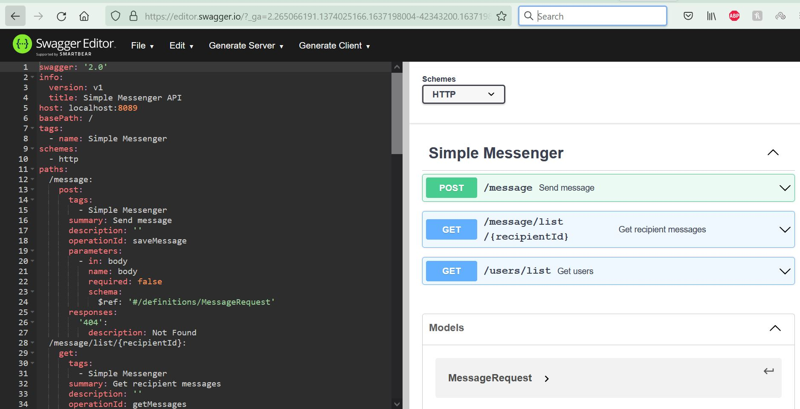
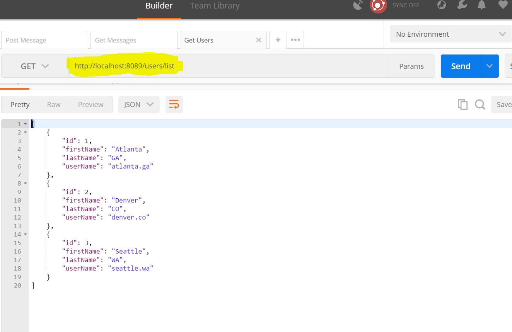
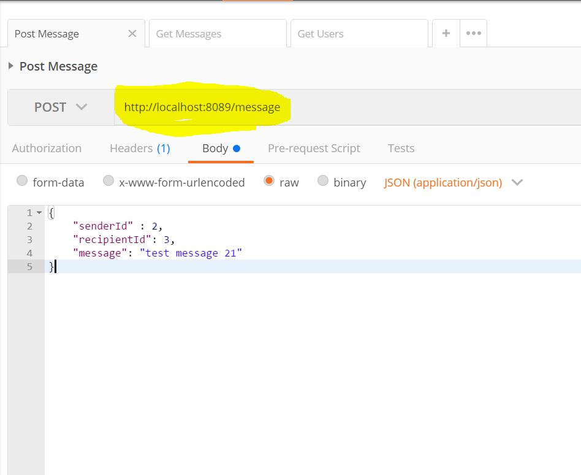
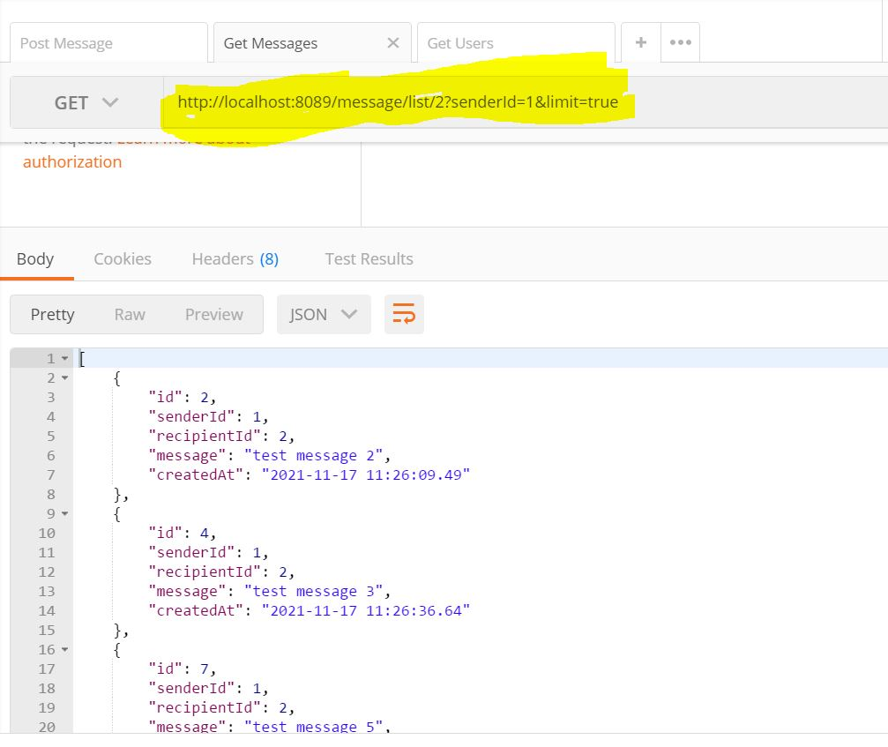

# Simple-Messenger-API Using Spring Boot

Backend api that would enable a web app to build a simple messenger application.

This is a Spring Boot application which exposes two API's for a web application to build a messenger app.
Used simple embbeded H2 file based database for data storage and for persistence.

Pre requisites:
1. Make sure Java 8 or higher is installed on our local system.
2. Install maven on our system.

Steps to Run the Application:
1. Clone or download the git repository named simple-messenger to your local.
2. Open your command line and change your directory to simple-messenger.
3. Run 'mvn clean install' to build the application.
4. Then go to '/target' directory where you will find 'simple-messenger-0.0.1-SNAPSHOT.jar' file and run 'java -jar simple-messenger-0.0.1-SNAPSHOT.jar' (by default the application will start on 8089, if the port is occupied or you want to use a different port, then traverse to src\main\resources\application.properties and change server.port to a different port).
5. On the application start the DB schema will be created. and we need to access h2 console to add users before we start using API for sending messages and getting messages.

H2 Console Access:

Access 'http://localhost:8089/h2-console' and the console looks like this.

Login Details:
1. Driver class: org.h2.Driver
2. JDBC Url: jdbc:h2:file:./data/simple-messenger-db
3. username: sa
4. password: password

make sure you use the above details and connect to DB. The console should look like the below image.

Once you see the console insert some values into users table.

Find the schema at '\src\main\resources\schema.sql' and users table data '\src\main\resources\data.sql' .

Sample Insert Query to add users: 

INSERT INTO users (first_name, last_name, username) VALUES
  ('Atlanta', 'GA', 'atlanta.ga'),
  ('Denver', 'CO', 'denver.co'),
  ('Seattle', 'WA', 'seattle.wa');
  
5. Now you are set to use the messenger API's to send and get messages.
6. Find the swagger API documentation in '\generated\swagger-ui\simple-messenger.json'.
7. We can access API's using swagger.io by importing the 'simple-messenger.json' file.

9. Access API's using postman.

Access Get Users API to find the users id, so that we can use the 'id' field to send messages from one user to another. and also to get messages.

GET: http://localhost:8089/users/list 

Post API to send a message

POST: http://localhost:8089/message

Request Body :
{
	"senderId" : 2,
	"recipientId": 3,
	"message": "test message 21"
}

Note: senderId and recipientId were the user id that we got from get users API.

Get API to access messages from sender

GET: http://localhost:8089/message/list/{recipientId}?senderId=1&limit=true

query parameters were optional, if we provide 'senderId' then we get messages from that particular sender else fetches messages from all senders and if we provide 'limit=true' then we limit the reponse to 100 else fetches messages from last 30 days.

References:

https://www.baeldung.com/spring-boot-h2-database followed this to create a h2 database.
